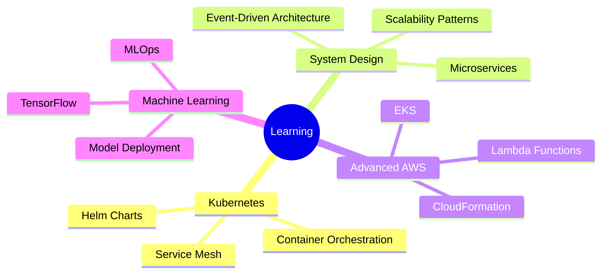

<div align="center">

# Full-Stack Software Engineer

👩‍💻 **Full-Stack Developer | Cloud Enthusiast | MS @ ASU** 👩‍💻

[](https://www.linkedin.com/in/prerana-nale)
[](mailto:naleprerana11@gmail.com)
[](mailto:pnale@asu.edu)


</div>

---

## 🧑‍💻 About Me
```javascript
const prerana = {
    location: "Phoenix, Arizona 🌵",
    education: "MS in Software Engineering @ ASU (GPA: 4.00/4.00)",
    currentRole: "Instructional Assistant @ ASU",
    previousRole: "Full-Stack Developer @ 4 Systems Info Solutions",
    interests: ["Web Accessibility", "Cloud Architecture", "Full-Stack Development"],
    funFact: "I teach 150+ students Java while building accessible web apps! 🎓",
    lookingFor: "Summer 2026 Software Engineering Internship",
    
    code: ["Python", "JavaScript", "TypeScript", "Java", "SQL"],
    askMeAbout: ["Web Development", "Cloud Computing", "Accessibility", "DevOps"],
    
    technologies: {
        frontEnd: {
            frameworks: ["React", "Redux Toolkit", "Next.js"],
            styling: ["Tailwind CSS", "CSS3", "Styled Components"],
            accessibility: ["ARIA", "WCAG 2.1", "Web Speech API"]
        },
        backEnd: {
            languages: ["Python", "Java", "Node.js"],
            frameworks: ["Spring Boot", "FastAPI", "Express"],
            apis: ["RESTful", "GraphQL"]
        },
        databases: ["PostgreSQL", "MongoDB", "MySQL", "Redis"],
        cloud: {
            aws: ["EC2", "S3", "RDS", "Lambda", "CloudWatch", "IAM", "KMS"],
            other: ["Azure", "Netlify", "Vercel"]
        },
        devOps: {
            containerization: ["Docker", "Docker Compose"],
            orchestration: ["Kubernetes", "ECS"],
            cicd: ["GitHub Actions", "Jenkins"],
            iac: ["Terraform", "CloudFormation"]
        },
        tools: ["Git", "VS Code", "Postman", "Jira"]
    },
    
    architecture: ["Microservices", "Event-Driven", "RESTful APIs", "Serverless"],
    
    achievements: {
        accessibility: "95/100 score (Top 2% globally) 🏆",
        performance: "75% improvement in data processing ⚡",
        testing: "90%+ test coverage 🧪",
        deployment: "60% reduction in deployment time 🚀"
    }
};
```

---

## 🚀 Featured Projects

<div align="center">

### 🍊 [Orange Sulphur - Accessible E-Commerce Platform](https://orange-sulphure.netlify.app/)

[](https://orange-sulphure.netlify.app/)
[](https://orange-sulphure.netlify.app/)
[](https://github.com/preranale)

**Production e-commerce platform achieving 95/100 accessibility score (top 2% globally)**

`React` `TypeScript` `Redux Toolkit` `Tailwind CSS` `Web Speech API` `WCAG 2.1`

- 🎤 Voice commands for hands-free shopping
- 👁️ Screen reader optimization (ARIA compliant)  
- 🎨 Colorblind modes (Protanopia, Deuteranopia, Tritanopia)
- ♿ Full WCAG 2.1 AA compliance

---

### 🔒 Secure Deployment Pipeline for LLM Agents

[](https://github.com/preranale)
[](https://github.com/preranale)

**Enterprise-grade MLSecOps framework with automated security testing**

`AWS ECS` `Python` `Docker` `Terraform` `FastAPI` `GitHub Actions`

- 🛡️ Zero secret leakage across 342 production queries
- ⚡ Sub-250ms API latency with 8.5% pipeline overhead
- 🔍 >95% vulnerability resolution rate with automated SAST
- 📊 Statistical validation (p < 0.01) proving production readiness

**Co-authored Research Paper** (CSE 543, Nov 2025)

---

### ⚙️ Cloud Infrastructure Automation & SRE Tools

[](https://github.com/preranale)

**Multi-cloud infrastructure automation toolkit**

`AWS` `Azure` `Terraform` `Python` `Jenkins`

- 🔧 Automated provisioning (VPC, EC2, S3, RDS)
- 📈 SRE monitoring with alerting & log aggregation
- 💰 Cost optimization strategies
- 🔄 80% reduction in manual provisioning time

</div>

---

## 💻 Tech Stack

<div align="center">

### Languages


### Frontend


### Backend


### Databases


### Cloud & DevOps


### Tools


</div>

---

## 📊 GitHub Stats

<div align="center">
  
  
</div>

<div align="center">
  
  
</div>

---

## 📈 Prerana's Contribution Graph

<div align="center">
  
</div>

---

## 💼 Experience Highlights

<div align="center">

| 🎯 Metric | 📊 Achievement |
|-----------|---------------|
| 💻 **Code Quality** | 90%+ Test Coverage |
| ⚡ **Performance** | 75% Processing Improvement |
| 🚀 **Deployment** | 60% Faster CI/CD |
| ♿ **Accessibility** | 95/100 Score (Top 2%) |
| 👥 **Teaching** | 150+ Students Mentored |
| 🏆 **GPA** | 4.00/4.00 @ ASU |
| 📄 **Research** | Published Paper (CSE 543) |

</div>

---

## 🎓 Education

<div align="center">

**🎓 Arizona State University**  
Master of Science in Software Engineering | **GPA: 4.00/4.00** | Expected May 2026

**Relevant Coursework:** Advanced Web Development • Data Structures & Algorithms • Software Design Patterns • Cloud Computing • Information Assurance & Security

</div>

---

## 📝 Recent Research

<div align="center">

### 📄 Secure Deployment Pipeline for LLM-based Agents (CI/CD)
**CSE 543: Information Assurance and Security** | November 2025

Co-authored comprehensive research on MLSecOps framework for secure LLM deployment
- ✅ Zero secret leakage validation
- ✅ Sub-250ms API latency
- ✅ Statistical significance (p < 0.01)
- ✅ Production-ready architecture

</div>

---

## 📝 Latest Blog Posts

<!-- BLOG-POST-LIST:START -->
- 🎤 Building Accessible Web Apps: Voice Commands with Web Speech API
- ☁️ Deploying Microservices on AWS EKS: A Complete Guide
- 🔒 Securing Your CI/CD Pipeline: Best Practices & Tools
- ⚡ Performance Optimization: From 8 Hours to 2 Hours
- 🧪 Achieving 90%+ Test Coverage: A Practical Approach
<!-- BLOG-POST-LIST:END -->

---

## 🤝 Connect With Me

<div align="center">

### Let's build something amazing together! 🚀

[](https://www.linkedin.com/in/prerana-nale)
[](mailto:naleprerana11@gmail.com)
[](mailto:pnale@asu.edu)
[](https://github.com/preranale)

### 💬 Open to

- 💼 **Software Engineering Internship Opportunities** (Summer 2026)
- 🤝 **Collaboration on Open Source Projects**
- 💡 **Interesting Technical Discussions**
- 🎓 **Mentoring & Knowledge Sharing**

</div>

---

## 🎯 2026 Goals

- ✅ Complete MS in Software Engineering (GPA: 4.00)
- 🎯 Land Software Engineering Internship at Top Tech Company
- 🎯 Contribute to 5+ Open Source Projects
- 🎯 Build 3 Production-Grade Full-Stack Applications
- 🎯 Master Kubernetes & System Design
- 🎯 Achieve AWS Solutions Architect Certification
- 🎯 Publish Technical Blog Posts (10+)

---

## 🌱 Currently Learning

<div align="center">


</div>

---

## 💭 Random Dev Quote

<div align="center">


</div>

---

## 😂 Random Dev Meme

<div align="center">


</div>

---

## ⚡ Fun Fact

<div align="center">
```python
while True:
    if coffee_level > 0:
        write_code()
        solve_problems()
        build_awesome_stuff()
    else:
        refill_coffee()
```

</div>

---

<div align="center">


**✨ Thanks for visiting my profile! Have a great day! ✨**

<sub>Made with ❤️ and lots of ☕ by Prerana Nale</sub>

</div>
